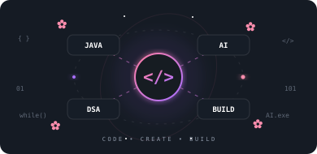

 

 

## 🌸 About Me

<table width="100%">
<tr>

<td width="60%" valign="top">

### Hey! I'm Subhadeep 👋

I'm a **B.Tech Computer Science student** interested in software development, backend engineering, problem solving, and AI & Data Science.

* 🎓 B.Tech CSE Student
* ☕ Currently building with **Java**
* 🧠 Practicing **Data Structures & Algorithms**
* 🚀 Solving problems on **LeetCode**
* 🤖 Exploring **AI & Data Science**
* 💻 Building real-world projects
* 📍 Kolkata, India

</td>

<td width="40%" valign="middle" align="center">

</td>

</tr>
</table>

  

## 🛠️ Tech Stack

 

 

 

  

## 📊 GitHub Activity

  

## 🌸 Contribution Snake

 

